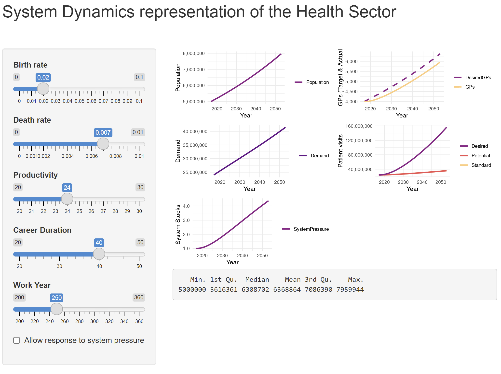

# System Dynamics Model

An implemention of the model from Duggan's paper: System Dynamics Modeling with R (Lecture Notes in Social Networks), Duggan, Jim.

A system dynamics representation of the health sector using Shiny. Systems 
thinking is a departure from linear thinking, as system dynamics attempts to 
understand nonlinear behaviour of participants over time using stocks, flows, 
feedback loops, table functions and other functions such as time delays. 

To clone this repository, in the terminal:

`git clone https://github.com/MaguireMaName/SDM.git`

`cd SDM`

## Contents

|File           | Description |
|:--------------|:------------|
| app.R         | the Shiny application      |
| dependencies.R| pacman is used to install and load required packages      |
| SDM.R         | the System Dynamc Model      |

## Contents

## Attributions:

 - Duggan, Jim. System Dynamics Modeling with R (Lecture Notes in Social Networks) Springer International Publishing. Kindle Edition.

 - Martín García, Juan. System Dynamics: Modeling, Simulation and Analysis 
